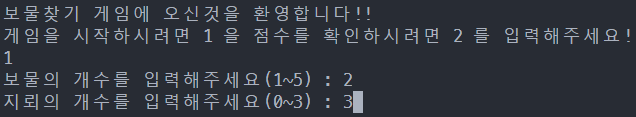

# GameProgramming

> 2022학년 2학기 게임 프로그레밍

## Description
##### 폴더 설명
* exCode - 예제 코드
* progress - 수업 진행 자료
* studyCode - 실습한 코드
* docs - html/css 실습
-------


#### 발표
- [보물찾기 원본](https://github.com/HanDaWoon/GameP-2022/blob/master/studyCode/org8_7_1.cpp) / [보물찾기 기능추가](https://github.com/HanDaWoon/GameP-2022/blob/master/studyCode/tr8_7_1_utf8.c) / [Google Slide](https://docs.google.com/presentation/d/1h3wNfcy48Jh8Rp-TKfeJPTBJ142Gzw1PY9V4cztL5R4/edit?usp=sharing)
- [Snake Game 원본](https://github.com/Pleiterson/snake-game-javascript) / [Snake Game 기능추가](https://github.com/HanDaWoon/snake-game-javascript) / [Google Slide](https://docs.google.com/presentation/d/15WtkpIcei3S87fdEKsJh83l-jf4OpYmV6tA66FWa-eo/edit?usp=sharing)

-------
#### DOCS
HTML과 CSS framework를 이용하여 만든 페이지 입니다.
##### CSS Framework
> [Bulma](https://bulma.io/) / [Bootstrap](https://getbootstrap.com/) / [Skeleton](http://getskeleton.com/)

  * ###### Bulma의 [Hero](https://bulma.io/documentation/layout/hero/)
    ``` html
    <div class="hero">
            <div class="hero-body">
                <div class="has-text-centered">
                    <p class="title">
                        홍길동의 이력서
                    ...
    ``` 
  * ###### Bootstrap의 [Card](https://getbootstrap.com/docs/5.2/components/card/#horizontal)
    ``` html
     <div class="card text-center border-primary mb-3">
        <div class="row g-0">
            <div class="col-md-4">
                
            </div>
            <div class="col-md-8">
                <div class="card-body">
                    <h5 class="card-title">My info</h5>
                    ...
                ...
            ...
        ...
    ``` 
  * ###### Skeleton의 [TYPOGRAPHY](http://getskeleton.com/#typography)
    ``` html
    <h1>...</h1>
    <h2>...</h2>
    <h3>...</h3>
    <h4>...</h4>
    ``` 
##### [Chart.js](https://www.chartjs.org/)
  * ###### Bar
  * ###### Line
  * ###### Pie 
>github.io와 netlify 배포주소
>[handawoon.github.io](https://handawoon.github.io/GameP-2022/) / [netlify](https://10-28.netlify.app/) 
    
-------

#### 보물찾기
기존 게임은 리눅스에서 구동이 불가능 했습니다.

때문에 리눅스 에서 구동하기 위해 몇가지 함수를 추가/수정 하였습니다.

지뢰/보물 개수를 조정 할 수 있게 하였습니다.

시작/종료 화면을 추가하였으며 파일을 통해 점수를 저장/확인 할 수 있도록 만들었습니다.

<p align="center"></p>
<p align="center"></p>

- [보물찾기 원본](https://github.com/HanDaWoon/GameP-2022/blob/master/studyCode/org8_7_1.cpp) / [보물찾기 기능추가](https://github.com/HanDaWoon/GameP-2022/blob/master/studyCode/tr8_7_1_utf8.c) / [Google Slide](https://docs.google.com/presentation/d/1h3wNfcy48Jh8Rp-TKfeJPTBJ142Gzw1PY9V4cztL5R4/edit?usp=sharing)
- 
-------

#### Snake Game
기존 게임에 기능을 추가하였습니다.
- [Snake Game 원본](https://github.com/Pleiterson/snake-game-javascript) / [Snake Game 기능추가](https://github.com/HanDaWoon/snake-game-javascript) / [Google Slide](https://docs.google.com/presentation/d/15WtkpIcei3S87fdEKsJh83l-jf4OpYmV6tA66FWa-eo/edit?usp=sharing)

-------

#### Find Coin
Unity를 이용한 기존 게임에 기능을 추가하였습니다.
- [원본](https://assetstore.unity.com/packages/3d/characters/eazy-camera-102275) /  [Google Slide](https://docs.google.com/presentation/d/1JcKJCU2uB9YWfynKRXF15ZwqXLHUrL4dj0sQubibXN0/edit?usp=sharing)
